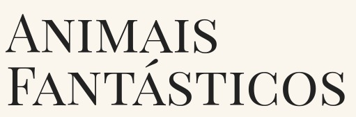

<h1 align="center">

</h1>

<ul>
<li><a target="_blank" href="#aplicacao">Sobre Animais Fantásticos</a></li>
<li><a target="_blank" href="#processo">Processo de desenvolvimento e aprendizado</a></li>
<li><a target="_blank" href="#curso">Sobre o curso</a></li>
<li><a target="_blank" href="#tech">Tecnologias utilizadas</a></li>
</ul>

<h2 id="aplicacao">Sobre Animais Fantásticos</h2>

<p> O site <strong><a target="_blank" href="https://thiagopederzolli.github.io/animais-fantasticos/">Animais Fantásticos</a></strong> é um dos dois projetos do curso de JavaScript Completo ES6 da plataforma de cursos <strong><a target="_blank" href="https://www.origamid.com/">Origamid</a></strong>. Ao longo do curso fomos trabalhando diversos conceitos do JS ES6+ e aplicando esse conhecimento no desenvolvimento da aplicação. Com isso desenvolvemos diversas features. São elas:
</p>
<ul>
<li> <h3> Accordion:</h3> <p> Efeito adicionado a seção FAQ, onde é possível exibir ou esconder uma resposta e permitir a pessoa usuária manter mais de uma resposta visível ou não.
</li>
<li> <h3> Animação dos números:</h3> <p> Efeito adicionado a seção Números, que executa uma contagem dinâmica dos números do zero ao valor total na primeira vez que a seção é exibida em tela.
</li>
<li> <h3> Dropdown menu:</h3> <p> Efeito adicionado ao elemento Sobre, no menu principal, onde ao se passar o mouse por cima ou clicar, abre um sub-menu com links para outras áreas do site relacionadas ao Sobre da aplicação.
</li>
<li> <h3> Fetch Animais:</h3> <p> Funcionalidade para exercitar como se trabalha de forma assíncrona em momentos que dependemos da resposta de uma API. Criou-se um JSON com informações sobre espécie e total de animais, que é carregado de forma assíncrona e preenche as informações da seção Números.
</li>
<li> <h3> Fetch Bitcoin:</h3> <p> Funcionalidade para exercitar como se trabalha de forma assíncrona em momentos que dependemos da resposta de uma API. Criou-se uma área na seção de contato para solicitar doações, para preencher esse campo, se faz uma requsição à uma API que retorna valores em Bitcoin, calculamos em relação ao Real e imprimimos na tela.
</li>
<li> <h3> Menu Mobile:</h3> <p> Aprendemos a fazer o famoso meu hamburger, estilizando para que seja possível também manter o sub-menu do Sobre sem perder a estética e funcionalidades.
</li>
<li> <h3>Modal:</h3> <p> Estilo um popup, que a pessoa usuária é direcionada ao clicar na opção Login no menu, abrindo uma tela central para que ela possa digitar login e senha para acessar a plataforma.
</li>
<li> <h3> OutsideClick:</h3> <p> Funcionalidade para pegar clicks fora de uma determinada região, por exemplo, para que quando a pessoa clique fora do modal, ele feche.
</li>
<li> <h3> Scroll Animado:</h3> <p> Efeito de carregar as seções conforme a pessoa usuária vai scrollando a página.
</li>
<li> <h3> Scroll Suave:</h3> <p> Efeito para adicionar uma navegação mais suave pela página, garantindo que ao clicar em um link interno a página role suavemente até a seção desejada.
</li>
<li> <h3>Navegação por Tab:</h3> <p> Efeito meio estilo ligue as colunas, é o efeito utilizado na primeira seção do site, onde ao clicar na imagem de um animal, o texto referente a ele é colocado em tela e ocultado o texto em relação ao outro animal que aparecia.
</li>
<li> <h3> Tooltip:</h3> <p> Efeito de criar uma caixa de texto estilo popup, ela surge ao passarmos o mouse por cima de algum elemento no site. Nessa aplicação esse efeito é percebido ao passarmos o mouse por cima do mapa na seção de contatos.
</li>
</ul>

<h2 id="processo"> Processo de desenvolvimento e aprendizado </h2>
<p>
A aplicação foi desenvolvida ao longo do curso conforme iamos estudando os conceitos de JS relevantes a cada uma dessas features, o que tornou o aprendizado ainda mais enriquecedor, porque era possível linkar a teoria com a prática e ter real noção do que era produzido.
</p>
<p>
A consolidação de todo o aprendizado se deu ao final do curso no processo de refatoração do projeto, onde foi possível ver o código em sua estrutura inicial e como era possível melhorá-lo em formas de possibilitar o reuso de código e deixar ele mais legível.
<p>

----------------


<h1 align="center">

</h1>

------------------------

<h2 id="curso"> Sobre o curso </h2>

<p> O objetivo principal do curso é trabalhar todos os principais conceitos do JS ES6+ e o objetivo é cumprido com maestria. 
</p>
<p>
Ele vai desde os primeiros passos para quem está iniciando, abordando variáveis, tipos de dados, funções, objetos, arrays e depois aprofundando cada um desses conceitos. 
</p>
<p>
É possível ter uma noção da quantidade de conteúdo que o curso aborda através desse meu repositório <strong><a target="_blank" href="https://github.com/ThiagoPederzolli/origamid-ES6"">Origamid-ES6</a></strong>. Nele armazenei diversas informações práticas e os exercícios que eram propostos ao longo do curso. É perceptível o nível de qualidade e profundidade do conteúdo.
</p>

---------------------
<h2 id="tech"> Tecnologias utilizadas </h2>

<p> Ao longo do curso aprendemos a utilizar várias ferramentas e tecnologias:

<ul>
<li>HTML</li>
<li>CSS</li>
<li>JavaScript</li>
<li>Git</li>
<li>GitHub</li>
<li>Node</li>
<li>API</li>
<li>ESLint</li>
<li>Babel</li>
<li>Webpack</li>
</ul>

------------------------------
<h2 id="usando"> Como baixar a aplicação </h2>

<p> Clone o repositório e instale as dependências: </p>

```
# clonar o repositório:
git clone git@github.com:ThiagoPederzolli/animais-fantasticos.git

# navegue até a pasta:
cd animais-fantasticos

# instale as dependências:
npm install
```

<p>Você pode executar ela em sua máquina através do plugin Live Server do VSCode</p>

<p>Realizando alguma alteração:</p>

```
# antes de qualquer modificação é necessário rodar o comando:
npm run dev

# após as alterações feitas:
npm run build

```
<p>isso irá gerar o arquivo main minificado</p>

-------------------------------
<p align="center">
Desenvolvido por © Thiago Pederzolli Machado da Silva!
</p>